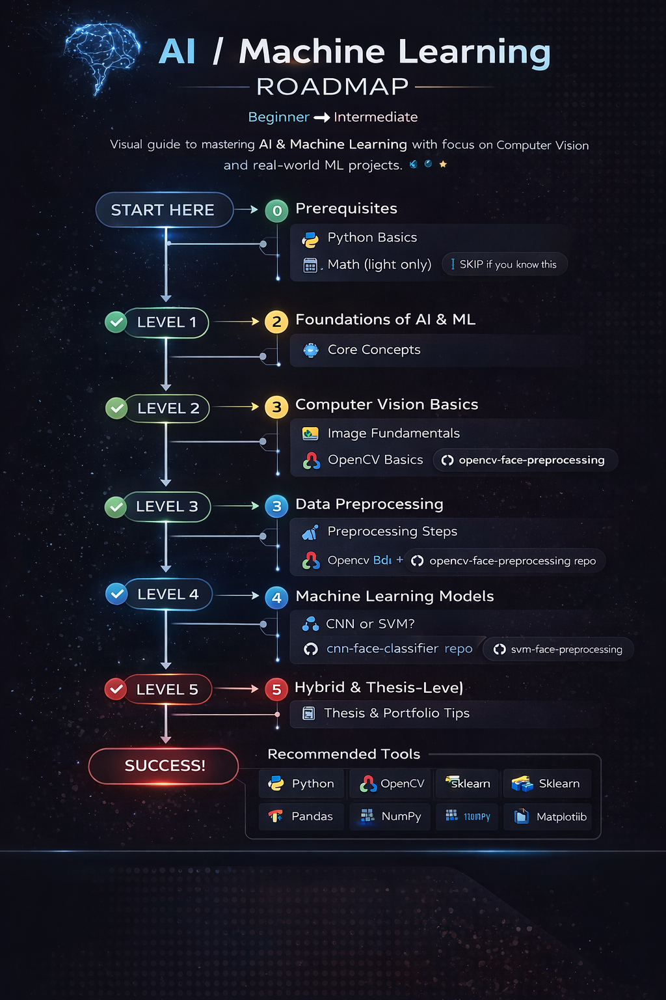

  

# ai-ml-roadmap
Beginner → Intermediate (Student &amp; Self-Learner Friendly)
A practical, visual roadmap for learning AI & Machine Learning, focused on Computer Vision, real projects, and thesis-ready skills.

👋 Who This Roadmap Is For

🎓 IT / CS students

👨‍💻 Beginner to intermediate developers

🧠 Self-learners entering AI & ML

📘 Thesis & capstone project builders

🧭 How to Use This Roadmap

Follow top → bottom

Skip sections you already know

Each level has clear goals

Repositories are linked for hands-on practice

🟢 LEVEL 0 — Prerequisites (Must Know)

Skip if you already know these

🐍 Python Basics

Variables, loops, functions

Lists, dictionaries

Virtual environments

📐 Light Math (Enough lang)

Mean, variance

Basic linear algebra idea

What gradients mean (conceptual)

🟢 LEVEL 1 — Foundations of AI & ML

Goal: Understand how machines “learn”

🧠 Core Concepts

What is Machine Learning?

Supervised vs Unsupervised learning

Training vs Testing

Overfitting & Underfitting

✔ Output: You can explain ML in simple words

🟡 LEVEL 2 — Computer Vision Basics

Goal: Understand images as data

📷 Image Fundamentals

Pixels & channels

Grayscale vs RGB

Image resolution

🛠 OpenCV Basics

Reading images

Resizing

Grayscale conversion

🔗 Practice Repo:
👉 opencv-face-preprocessing

🟡 LEVEL 3 — Data Preprocessing (VERY IMPORTANT)

Goal: Prepare clean data for ML models

🧹 Preprocessing Steps

Face detection

Image resizing

Normalization

Dataset organization

⚠️ Common mistakes:

Mixed image sizes

No preprocessing

Dirty datasets

🔗 Practice Repo:
👉 opencv-face-preprocessing

🔵 LEVEL 4 — Machine Learning Models

Goal: Train models on image data

🤖 Convolutional Neural Networks (CNN)

What CNNs are

Feature extraction

Why CNNs work well for images

📈 Support Vector Machine (SVM)

What SVM is

When SVM is better than CNN

Small dataset advantage

Model	Difficulty	Use Case
CNN	Medium	Large image datasets
SVM	Medium	Smaller, clean datasets
🔵 LEVEL 5 — Model Evaluation

Goal: Know if your model is actually good

📊 Evaluation Metrics

Accuracy

Precision

Recall

Confusion Matrix

⚠️ Warning:

High accuracy ≠ good model

🔴 LEVEL 6 — Hybrid Models (Intermediate)

Goal: Combine strengths of multiple models

🔥 Hybrid CNN–SVM

CNN as feature extractor

SVM as classifier

Better generalization

🧠 Real-world use:

Face classification

Emotion detection

Intoxication detection

🔗 Related Project:
👉 cnn-svm-hybrid-face-classifier (coming soon)

🔴 LEVEL 7 — Dataset, Ethics & Reality Checks

Goal: Think like a real AI engineer

⚠️ Dataset Issues

Lighting bias

Pose variations

Imbalanced classes

⚖️ Ethics & Privacy

Face data sensitivity

Consent & legality

Responsible AI usage

⚠️ Important: Always respect privacy when working with face data.

🎓 LEVEL 8 — Thesis & Capstone Ready

Goal: Turn learning into academic & portfolio success

📘 Thesis Tips

Dataset justification

Algorithm comparison

Panel defense readiness

💼 Portfolio Tips

Clean README

Clear problem statement

Reproducible results

🧰 Recommended Tools
Category	Tools
Language	Python
CV	OpenCV
ML	TensorFlow, Scikit-learn
Data	NumPy, Pandas
Visualization	Matplotlib
🚀 What To Do Next

1️⃣ Start with opencv-face-preprocessing
2️⃣ Learn CNN basics
3️⃣ Try SVM
4️⃣ Build a Hybrid model
5️⃣ Prepare for thesis or portfolio

📌 Author

Ares Coding
AI & Software Developer
GitHub: https://github.com/ares-coding

📜 License

MIT License — free to use with attribution.
